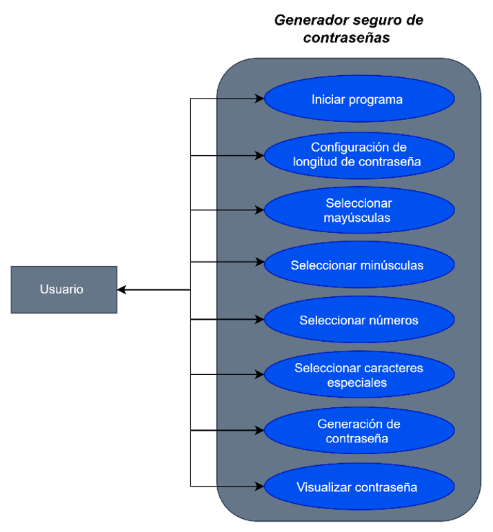
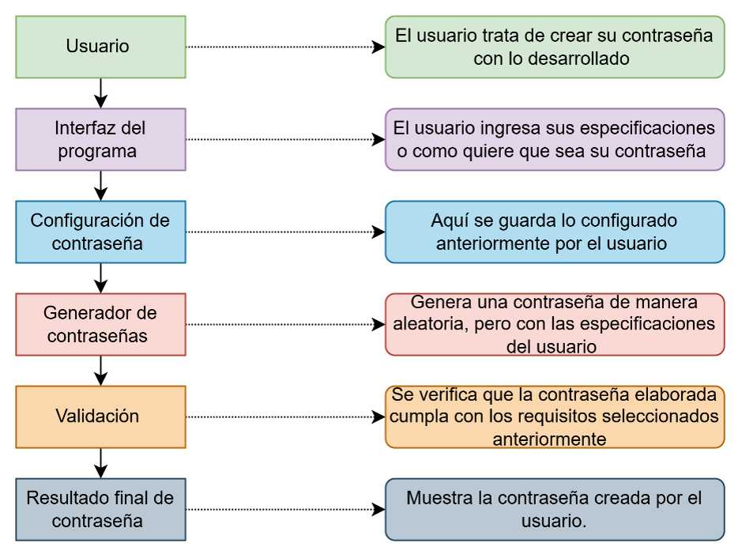

# 🔐 Generador Seguro de Contraseñas


---

## 👨‍💻 Información del proyecto

**Nombre del proyecto:** Generador Seguro de Contraseñas
**Estudiante:** Franco Espín
**Fecha:** 22/09/2026
**Lenguaje utilizado:** Python

---

## 🎯 Objetivo del sistema

Desarrollar en **Python** un programa que pueda crear contraseñas seguras de manera automática y aleatoria.

El sistema busca facilitar la creación de contraseñas mediante un proceso sencillo, permitiendo al usuario generar diferentes opciones y elegir la que considere más adecuada o fácil de recordar.

---

## ⚙️ Descripción de funcionalidades

El programa permite al usuario:

* 🔢 Elegir la cantidad de caracteres de la contraseña.
* 🔐 Generar una contraseña de manera automática y aleatoria.
* 🔤 Utilizar diferentes tipos de caracteres.
* 👀 Visualizar la contraseña generada.
* 🔄 Generar nuevas contraseñas para encontrar una opción adecuada o fácil de recordar.

> **Nota:** El programa está diseñado para generar contraseñas. No permite recuperar ni almacenar contraseñas existentes.

---

## 🛠️ Tecnologías utilizadas

* 🐍 **Python**
* 💻 **Visual Studio Code**
* 🌐 **GitHub**

---

## 📁 Estructura del proyecto

```text
Generador-Seguro-de-Contraseñas/
│
├── 📄 generador.py
├── 📄 README.md
│
└── 📁 diagramas/
    ├── 📊 casos_de_uso.png
    └── 🏗️ arquitectura.png
```

### 📄 `generador.py`

Contiene el código principal del sistema encargado de generar las contraseñas de forma automática y aleatoria.

### 📄 `README.md`

Contiene la información general, objetivo, funcionalidades y documentación del proyecto.

### 📁 `diagramas`

Contiene los diagramas utilizados para representar el funcionamiento y la estructura del sistema.

---

## 📊 Diagramas del proyecto

### 👤 Diagrama de casos de uso

Representa las interacciones entre el usuario y el sistema, mostrando las acciones principales que puede realizar al utilizar el generador seguro de contraseñas.



---

### 🏗️ Diagrama de arquitectura

Representa la estructura general del sistema y la relación entre los principales componentes que forman parte del proyecto.



---

## ▶️ Funcionamiento del sistema

El usuario inicia el programa y proporciona los datos solicitados. Posteriormente, el sistema procesa la información y genera automáticamente una contraseña aleatoria.

El usuario puede visualizar el resultado y generar nuevas opciones hasta encontrar una contraseña que considere adecuada.

---

## 🔒 Importancia de las contraseñas seguras

Las contraseñas son un elemento importante para proteger cuentas y servicios digitales. Utilizar contraseñas diferentes y difíciles de adivinar puede ayudar a reducir los riesgos relacionados con accesos no autorizados.

Este proyecto demuestra cómo la programación puede utilizarse para automatizar la creación de contraseñas mediante un proceso sencillo.

---

## 🎓 Aprendizaje aplicado

Durante el desarrollo del proyecto se aplicaron conceptos básicos de **lógica de programación y Python**, entre ellos:

* Variables
* Entrada de datos
* Condicionales `if`, `elif` y `else`
* Bucles `for` y `while`
* Generación aleatoria
* Uso de caracteres
* Salida de información

---

## 📌 Alcance del proyecto

El sistema está enfocado exclusivamente en la **generación automática de contraseñas**.

No incluye funciones para:

* Recuperar contraseñas.
* Almacenar contraseñas.
* Administrar cuentas de usuario.
* Acceder a contraseñas existentes.

---

## 👨‍💻 Autor

**Franco Espín**

📚 Proyecto académico — 2026
